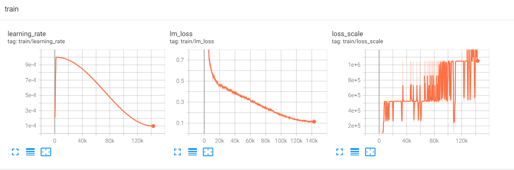

1. Tested the pretrain workflow of the LLM Ray, addressing issues related to training logs only recording the final loss and discrepancies in the random seed with the Gaudi interface.

2. Conducted investigation on existing pretrain workflows, opted for GPT-NeoX for validation, successfully set up the environment, and trained Pythia 70m on the English Wikipedia dataset, with the loss curve aligning with expectations.

Next Steps:
1. Integrate Pythia model support and relevant dataset support into the LLM Ray workflow, proceed with training, and compare loss curves.


## Why we need deepspeed backend


**W/O deepspeed backend**
```bash
(RayTrainWorker pid=686741, ip=172.18.0.3) 2023-11-24 01:14:22,222 - common - CRITICAL - HuggingFaceModelFromConfig call error: Check batch related parameters. train_batch_size is not equal to micro_batch_per_gpu * gradient_acc_step * world_size 2 != 1 * 1 * 1
(RayTrainWorker pid=686741, ip=172.18.0.3) Traceback (most recent call last):
(RayTrainWorker pid=686741, ip=172.18.0.3)   File "/workspace/llm-ray/common/load.py", line 67, in load_model
(RayTrainWorker pid=686741, ip=172.18.0.3)     _ = Factory()(config)
(RayTrainWorker pid=686741, ip=172.18.0.3)   File "/workspace/llm-ray/pretrain/plugin/huggingface_model_from_config.py", line 15, in __call__
(RayTrainWorker pid=686741, ip=172.18.0.3)     model = transformers.AutoModelForCausalLM.from_config(auto_config)
(RayTrainWorker pid=686741, ip=172.18.0.3)   File "/home/zhangjian/.conda/envs/megatron-deepspeed/lib/python3.9/site-packages/transformers/models/auto/auto_factory.py", line 441, in from_config
(RayTrainWorker pid=686741, ip=172.18.0.3)     return model_class._from_config(config, **kwargs)
(RayTrainWorker pid=686741, ip=172.18.0.3)   File "/home/zhangjian/.conda/envs/megatron-deepspeed/lib/python3.9/site-packages/transformers/modeling_utils.py", line 1189, in _from_config
(RayTrainWorker pid=686741, ip=172.18.0.3)     with deepspeed.zero.Init(config_dict_or_path=deepspeed_config()):
(RayTrainWorker pid=686741, ip=172.18.0.3)   File "/home/zhangjian/.conda/envs/megatron-deepspeed/lib/python3.9/site-packages/deepspeed/runtime/config.py", line 776, in __init__ [repeated 2x across cluster]
(RayTrainWorker pid=686741, ip=172.18.0.3)     _ds_config = deepspeed.runtime.config.DeepSpeedConfig(config_dict_or_path,
(RayTrainWorker pid=686741, ip=172.18.0.3)     self._configure_train_batch_size()
(RayTrainWorker pid=686741, ip=172.18.0.3)   File "/home/zhangjian/.conda/envs/megatron-deepspeed/lib/python3.9/site-packages/deepspeed/runtime/config.py", line 952, in _configure_train_batch_size
(RayTrainWorker pid=686741, ip=172.18.0.3)     self._batch_assertion()
(RayTrainWorker pid=686741, ip=172.18.0.3)   File "/home/zhangjian/.conda/envs/megatron-deepspeed/lib/python3.9/site-packages/deepspeed/runtime/config.py", line 900, in _batch_assertion
(RayTrainWorker pid=686741, ip=172.18.0.3)     assert train_batch == micro_batch * grad_acc * self.world_size, (
(RayTrainWorker pid=686741, ip=172.18.0.3) AssertionError: Check batch related parameters. train_batch_size is not equal to micro_batch_per_gpu * gradient_acc_step * world_size 2 != 1 * 1 * 1
```

在transformer 4.26中，包含deepspeed.initialize(**kwargs)
```py
def deepspeed_init(trainer, num_training_steps, resume_from_checkpoint=None, inference=False):

    # ...

    deepspeed_engine, optimizer, _, lr_scheduler = deepspeed.initialize(**kwargs)

    if resume_from_checkpoint is not None:

        # it's possible that the user is trying to resume from model_path, which doesn't necessarily
        # contain a deepspeed checkpoint. e.g. examples just check if the dir exists and assume it's
        # a resume from a checkpoint and not just a local pretrained weight. So we check here if the
        # path contains what looks like a deepspeed checkpoint
        import glob

        deepspeed_checkpoint_dirs = sorted(glob.glob(f"{resume_from_checkpoint}/global_step*"))

        if len(deepspeed_checkpoint_dirs) > 0:
            logger.info(f"Attempting to resume from {resume_from_checkpoint}")
            # this magically updates self.optimizer and self.lr_scheduler
            load_path, _ = deepspeed_engine.load_checkpoint(
                resume_from_checkpoint, load_optimizer_states=True, load_lr_scheduler_states=True
            )
            if load_path is None:
                raise ValueError(f"[deepspeed] failed to resume from checkpoint {resume_from_checkpoint}")
        else:
            logger.info(f"{resume_from_checkpoint} doesn't have deepspeed checkpoints, doing nothing")

    return deepspeed_engine, optimizer, lr_scheduler

```


在transformer 4.35中，没有了deepspeed.initialize相关的代码，因为实际上accelerate中包含deepspeed init，然而因为ray的
torch trainer中有了torch init，导致跳过了accelerate中的deepspeed init，而transformer版本的更新导致已经不存在原有的deepspeed init，最终出现问题

```py
def deepspeed_init(trainer, num_training_steps, inference=False):
    """
    Init DeepSpeed, after updating the DeepSpeed configuration with any relevant Trainer's args.

    If `resume_from_checkpoint` was passed then an attempt to resume from a previously saved checkpoint will be made.

    Args:
        trainer: Trainer object
        num_training_steps: per single gpu
        resume_from_checkpoint: path to a checkpoint if to resume from after normal DeepSpeedEngine load
        inference: launch in inference mode (no optimizer and no lr scheduler)

    Returns: optimizer, lr_scheduler

    We may use `deepspeed_init` more than once during the life of Trainer, when we do - it's a temp hack based on:
    https://github.com/microsoft/DeepSpeed/issues/1394#issuecomment-937405374 until Deepspeed fixes a bug where it
    can't resume from a checkpoint after it did some stepping https://github.com/microsoft/DeepSpeed/issues/1612

    """
    from deepspeed.utils import logger as ds_logger

    model = trainer.model
    args = trainer.args

    hf_deepspeed_config = trainer.accelerator.state.deepspeed_plugin.hf_ds_config

    # resume config update - some bits like `model` and `num_training_steps` only become available during train
    hf_deepspeed_config.trainer_config_finalize(args, model, num_training_steps)

    # set the Deepspeed log level consistent with the Trainer
    ds_logger.setLevel(args.get_process_log_level())

    if inference:
        # only Z3 makes sense for the inference
        if not hf_deepspeed_config.is_zero3():
            raise ValueError("ZeRO inference only makes sense with ZeRO Stage 3 - please adjust your config")

        # in case the training config is re-used for inference
        hf_deepspeed_config.del_config_sub_tree("optimizer")
        hf_deepspeed_config.del_config_sub_tree("lr_scheduler")
        optimizer, lr_scheduler = None, None
        model_parameters = None
    else:
        trainer.optimizer = None  # important for when deepspeed_init is used as re-init
        model_parameters = list(filter(lambda p: p.requires_grad, model.parameters()))
        optimizer, lr_scheduler = deepspeed_optim_sched(
            trainer, hf_deepspeed_config, args, num_training_steps, model_parameters
        )

    # keep for quick debug:
    # from pprint import pprint; pprint(config)

    return optimizer, lr_scheduler
```

## pretrain validation

1. dataset
   1. **enwik8: 35MB**
   2. Pile: 800GB
   3. github
   4. arxiv
2. tokenizer
   1. **hf tokenzier**
   2. sentence piece
   3. gpt2 tokenizer
3. model
   1. pythia [**70m**, 160m, ..., 12b]
   2. llama [7b, 13b, 30b, 65b] 


training detail: 
143000step，8gpu，zero stage1

